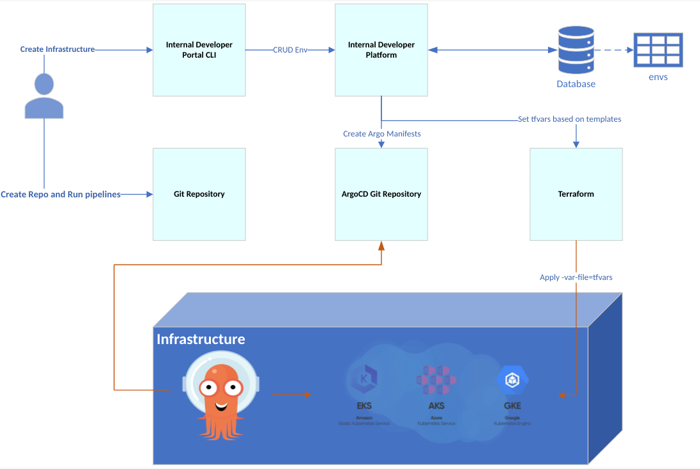

# Simple IDP

**SimpleIDP** is an Internal Developer Portal designed to manage multi-cloud environments, Kubernetes clusters, and project deployments seamlessly. With a user-friendly interface and robust backend powered by Django and React, SimpleIDP simplifies infrastructure management for development teams.

## Main Architecture Design
This is a blue-print of the project.

## Improvements and Adaptations
* The CLI changed to React UI
* The Models changed to: Cloud, Project, Cluster
* A monorepo created ([simpleIDP-projects](https://github.com/rezachalak/simpleIDP-projects)) in order to automatically create projects based on templates there.
